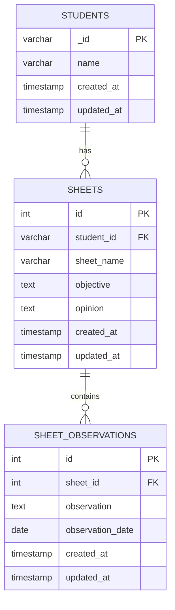
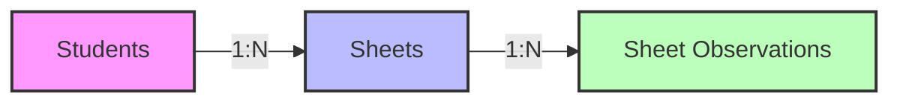
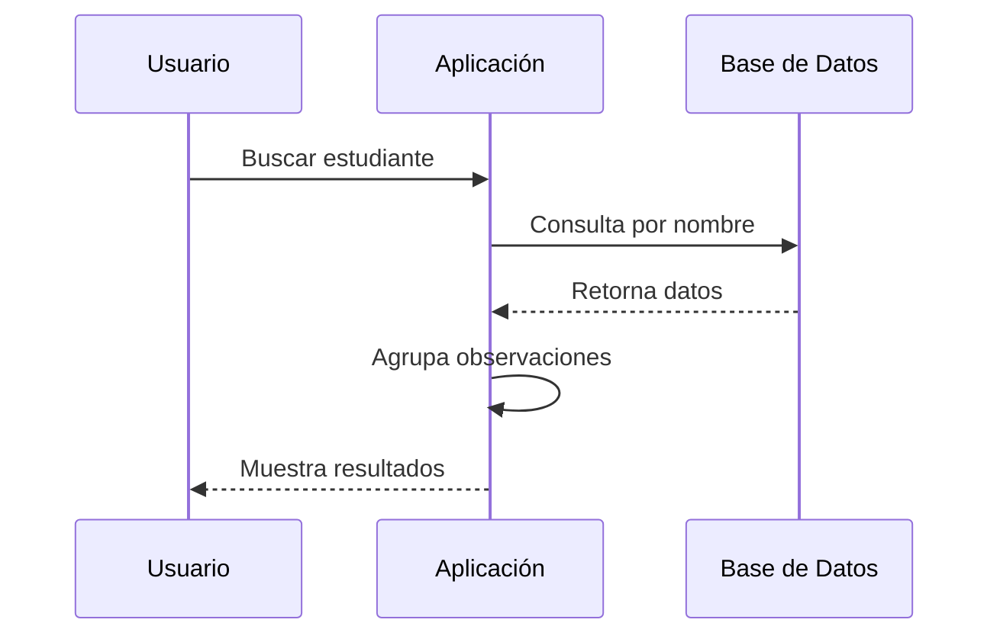

# Sistema de Gestión de Observaciones de Estudiantes

Este proyecto es una aplicación de escritorio desarrollada con Avalonia UI y .NET que permite gestionar y realizar seguimiento de las observaciones de estudiantes, utilizando Entity Framework Core para la gestión de la base de datos PostgreSQL.

## 🚀 Características Principales

- Búsqueda de estudiantes insensible a mayúsculas/minúsculas
- Visualización de observaciones cronológicas por estudiante
- Interfaz gráfica moderna con Avalonia UI
- Persistencia de datos con PostgreSQL
- Arquitectura orientada a objetos

## 🛠️ Tecnologías Utilizadas

- **.NET 8.0**: Framework base de desarrollo
- **Avalonia UI**: Framework de interfaz gráfica multiplataforma
- **Entity Framework Core**: ORM para acceso a datos
- **PostgreSQL**: Sistema de gestión de base de datos
- **Npgsql**: Proveedor de PostgreSQL para .NET

## 📊 Diagramas de la Base de Datos

### Diagrama Entidad-Relación


### Diagrama de Relaciones


### Detalle de Relaciones

1. **Students → Sheets**
   - Un estudiante puede tener múltiples hojas
   - Cada hoja pertenece a un solo estudiante
   - Relación mediante `student_id` en la tabla `sheets`

2. **Sheets → Sheet Observations**
   - Una hoja puede tener múltiples observaciones
   - Cada observación pertenece a una sola hoja
   - Relación mediante `sheet_id` en la tabla `sheet_observations`

### Flujo de Datos


## 📦 Estructura de la Base de Datos

### Tablas Principales:

#### students
- `_id` (varchar, PK): Identificador único del estudiante
- `name` (varchar): Nombre del estudiante
- `created_at` (timestamp): Fecha de creación
- `updated_at` (timestamp): Fecha de última actualización

#### sheets
- `id` (integer, PK): Identificador único de la hoja
- `student_id` (varchar, FK): Referencia al estudiante
- `sheet_name` (varchar): Nombre de la hoja
- `objective` (text): Objetivo de la hoja
- `opinion` (text): Opinión sobre el progreso
- `created_at` (timestamp): Fecha de creación
- `updated_at` (timestamp): Fecha de última actualización

#### sheet_observations
- `id` (integer, PK): Identificador único de la observación
- `sheet_id` (integer, FK): Referencia a la hoja
- `observation` (text): Contenido de la observación
- `observation_date` (date): Fecha de la observación
- `created_at` (timestamp): Fecha de creación
- `updated_at` (timestamp): Fecha de última actualización

## 🔧 Configuración del Proyecto

### Requisitos Previos
- .NET SDK 8.0 o superior
- PostgreSQL 12 o superior
- Visual Studio Code (recomendado) o Visual Studio 2022

### Configuración de la Base de Datos
1. Crear una base de datos en PostgreSQL
2. Actualizar la cadena de conexión en `appsettings.json`:
```json
{
  "ConnectionStrings": {
    "PostgreSQL": "Host=localhost;Database=your_database;Username=your_user;Password=your_password"
  }
}
```

### Migración de la Base de Datos
```bash
# Instalar herramientas de Entity Framework
dotnet tool install --global dotnet-ef

# Crear migración inicial
dotnet ef migrations add InitialCreate

# Aplicar migración
dotnet ef database update
```

## 🚀 Ejecución del Proyecto

```bash
# Restaurar dependencias
dotnet restore

# Compilar el proyecto
dotnet build

# Ejecutar la aplicación
dotnet run
```

## 💡 Características de la Implementación

### Entity Framework Core
- Utilización de Code First para el modelado de datos
- Configuración de relaciones entre entidades
- Migraciones automatizadas
- Consultas LINQ para operaciones de base de datos

### Avalonia UI
- Interfaz de usuario moderna y responsive
- Ventanas modales para búsqueda de estudiantes
- Campos de entrada con validación
- Visualización formateada de resultados

### Características de Búsqueda
- Búsqueda insensible a mayúsculas/minúsculas usando `EF.Functions.ILike`
- Agrupación de resultados por estudiante
- Ordenamiento cronológico de observaciones
- Visualización de las últimas observaciones por estudiante

## 🤝 Contribuir

Las contribuciones son bienvenidas. Por favor, abre un issue para discutir cambios mayores antes de crear un pull request.

## 📄 Licencia

Este proyecto está bajo la Licencia MIT. Ver el archivo `LICENSE` para más detalles.